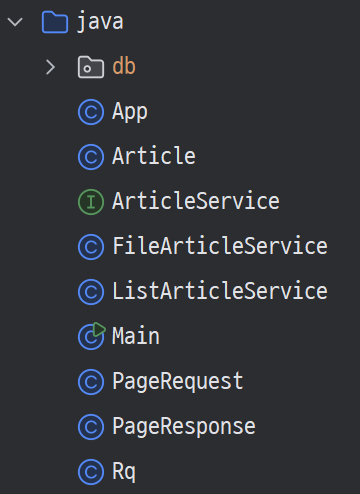
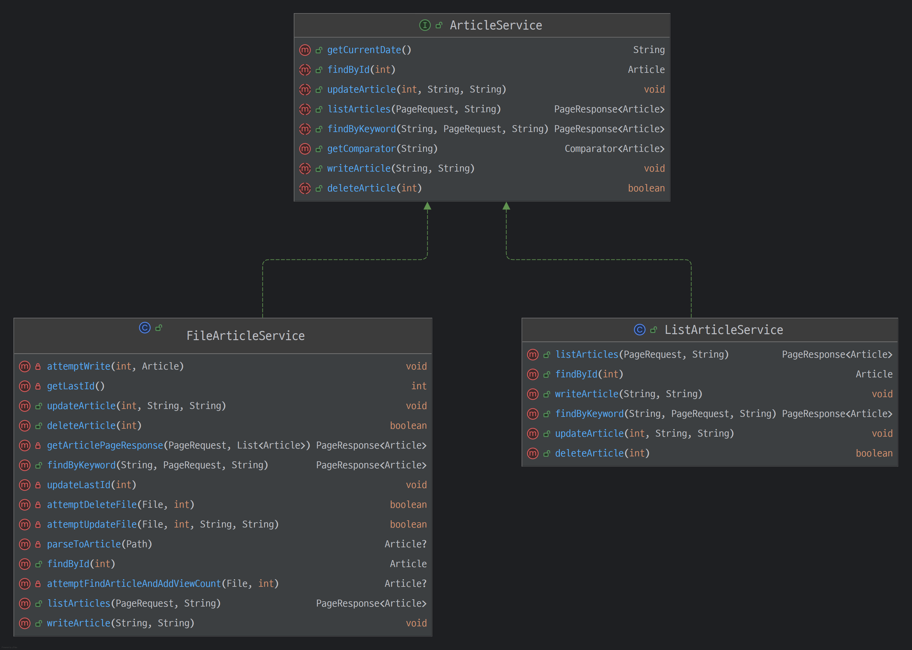

# 자바로 구현하는 CLI 게시판 서비스

## ✅ 요구사항

> - `Scanner` 입력을 바탕으로 콘솔 기반 게시판을 구현해야 합니다.
> - 최대한 TDD의 워크플로(레드, 그린, 블루)를 준수하여 작업합니다.

---

## 🗂️코드 구조

### 🚀 Main

- 전체 프로그램의 진입점입니다.
- `main` 메서드를 실행하여 프로그램을 시작합니다.

> ➡️ [코드 보러 가기](https://github.com/geun-00/cli-service/blob/main/src/main/java/Main.java)

### 🚀 Article

- 엔티티로 사용되는 클래스입니다.
- 아이디, 생성일, 제목, 내용, 조회수로 이루어져 있습니다.

> ➡️ [코드 보러 가기](https://github.com/geun-00/cli-service/blob/main/src/main/java/Article.java)

### 🚀 PageRequest

- 페이징 처리 시 사용되는 페이징 요청 DTO 입니다.
- 사용자가 원하는 페이지 번호, 페이지 크기 정보로 이루어져 있습니다.
- 사용자가 페이지 정보를 명시하지 않으면 기본적으로 페이지 번호는 1, 페이지 크기는 10으로 설정됩니다.

> ➡️ [코드 보러 가기](https://github.com/geun-00/cli-service/blob/main/src/main/java/PageRequest.java)

### 🚀 PageResponse

- 페이징 처리 시 사용되는 페이징 응답 DTO 입니다.
- 데이터 목록, 총 페이지, 현재 페이지, 총 데이터 개수로 이루어져 있습니다.
- 제네릭으로 설계하여 다양한 객체를 저장할 수 있습니다.

> ➡️ [코드 보러 가기](https://github.com/geun-00/cli-service/blob/main/src/main/java/PageResponse.java)

### 🚀 Rq

- 사용자의 콘솔 입력을 받아 메인 커멘드와 그 외 파라미터 정보를 저장하는 클래스입니다.
- 주요 커멘드는 `detail`, `update`, `delete`, `search`, `orderby`, `list` 입니다.
- HTTP 쿼리 스트링 방식이 아닌 공백으로 구분하여 파싱합니다.
  - ex) `detail [id]` : `detail 1`
  - ex) `update [id]` : `update 1`
  - ex) `delete [id]` : `delete 1`
  - ex) `search [keyword]` : `search 자바 공부`
  - ex) `orderby [sortOption]` : `orderby id`
  - ex) `list`
  - ex) `list pageNum=3 pageSize=5`
    - (`pageNum`과 `pageSize`의 순서는 상관 없습니다.)

> ➡️ [코드 보러 가기](https://github.com/geun-00/cli-service/blob/main/src/main/java/Rq.java)

### 🚀 ArticleService

- `Article` 엔티티를 저장 및 관리하는 클래스입니다.
- 인터페이스로 설계하여 메모리에 저장하기와 파일에 저장하기를 구현하였습니다.
- 어디에 저장할지는 `App` 클래스의 생성자에서 선택할 수 있습니다.
- 공통으로 사용할 포맷팅한 현재 날짜 확인하는 메서드(`getCurrentDate()`)와 정렬할 때 사용할 수 있는 비교자를 구하는 메서드(`getComparator()`)를
default 메서드로 만들어 두었습니다.

> - ➡️ [코드 보러 가기(ArticleService)](https://github.com/geun-00/cli-service/blob/main/src/main/java/ArticleService.java)
> - ➡️ [코드 보러 가기(ListArticleService)](https://github.com/geun-00/cli-service/blob/main/src/main/java/ListArticleService.java)
> - ➡️ [코드 보러 가기(FileArticleService)](https://github.com/geun-00/cli-service/blob/main/src/main/java/FileArticleService.java)

---

## ✏️ 회고

- 스프링에서 기본적으로 구현해주고 있는 기능을 직접 구현해 보면서 스프링의 내부적인 원리를
조금이나마 이해할 수 있었습니다.
- 평소 `java.nio` 패키지를 사용할 일이 없어 사용 방법을 잘 몰랐는데 이번 기회에
사용법을 익힐 수 있었습니다.
- TDD 사이클을 적용하기 위해 노력해보면서 테스트 코드 작성 방법을 손에 익힐 수 있었습니다.
하지만 스프링에서 복잡한 로직을 어떻게 TDD를 적용할 수 있을지는 확신이 없습니다.